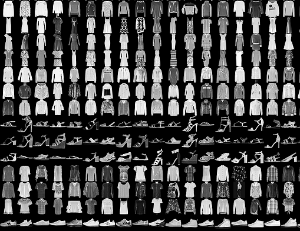

# **Foundations of Deep Learning**

**Overview:**

This document will provide a sense of the general motivation for the project. It will also explain, at a high level, the technologies used and techniques deployed, as well as potential takeaways and areas for further improvement/exploration.

**Motivation:**

To learn how to use TensorFlow to implement the most important and foundational principles of Machine Learning and Deep Learning so that we can start building and applying scalable models to real-world problems. To prepare ourselves to build scalable AI-powered algorithms by developing a solid understanding of how to use appropriate tools to build them. Specifically, to learn best practices for using TensorFlow, a popular open-source framework for machine learning.

**Interpretation:**

As an exploratory exercise, we aim to build and train a basic neural network for computer vision in TensorFlow, incorporating the use of convolutions to improve network performance. That is, to implement a dynamic machine learning solution for identifying real-world images.

**Technologies and Techniques:**

Python 3.6 for scripting callbacks, pooling, etc. in TensorFlow 1.X/2.0 Alpha

Implementing Convolutions for Neural Network Improvement

Model Validation using the Fashion MNIST dataset

**Potential Takeaways/Implications:**

The ability of a system to accurately identify/classify visual input relating to clothing and accessories can be constructed, trained, implemented, and improved upon by leveraging convolutional neural networks.

**Areas for Improvement and/or Future Exploration:**

The competencies attained hereby will empower us to build and train neural networks to be able to effectively understand, analyze, and/or respond to audiovisual inputs, ranging from human speech to hand-written text, images, etc.

**Author(s):**

Daniel S. Toohey

**Acknowledgements/Links:**

Andrew Ng, deeplearning.ai

Laurence Maroney, Google Brain

Coursera